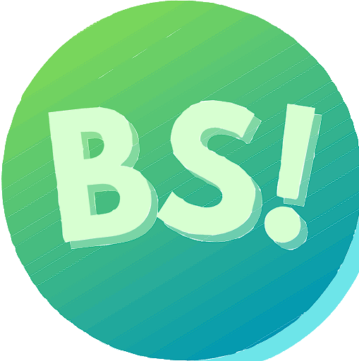
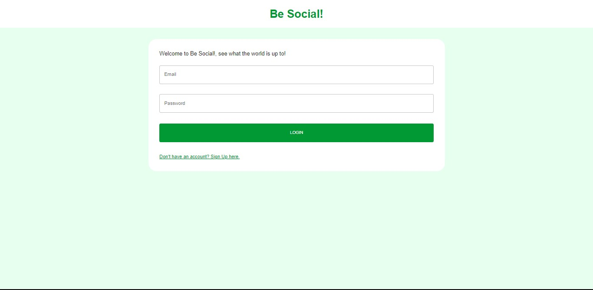
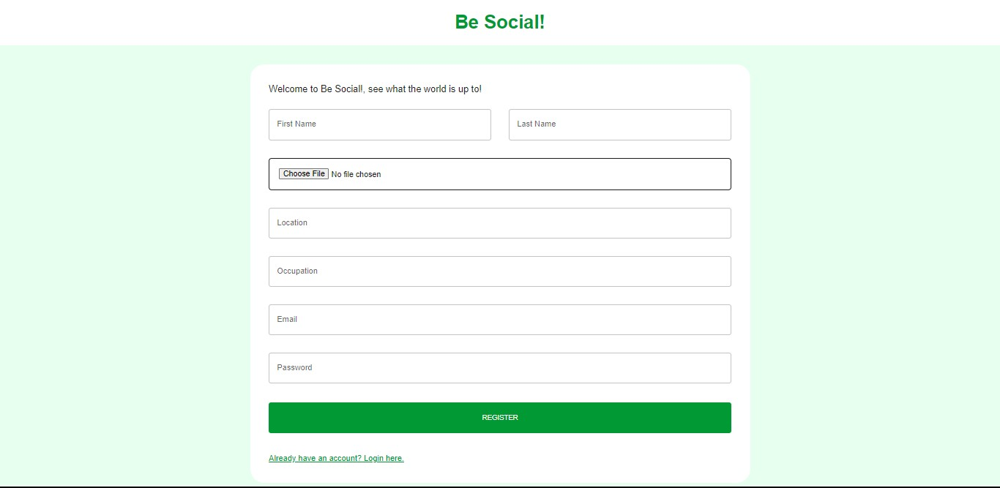
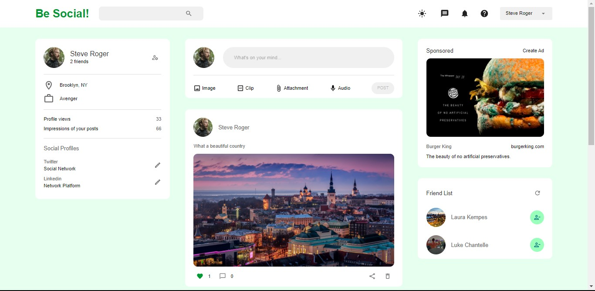
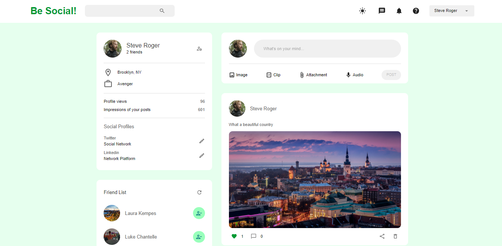

#  Be Social!
<h2>Be Social! is a fullstack web application that simulates a social media app.</h2>

<h3>Frameworks and libraries used:</h3>
<ul>
  <li>React</li>
  <li>JWT</li>
  <li>Redux Toolkit</li>
  <li>Mui</li>
  <li>Express</li>
  <li>Mongoose (MongoDB database)</li>
</ul>

<h3>App funtionalities:</h3>
<ul>
  <li>User Sign In</li>
  <li>Post creation with images</li>
  <li>Likes</li>
  <li>Comments</li>
  <li>Add friends</li>
</ul>

<h3>Log In page</h3>

<h3>Sign In page</h3>

<h3>Home page</h3>

<h3>Profile page</h3>

<h3>Take a look at <a href="https://mollgerman-besocial.netlify.app/" target="_blank" rel="noopener noreferrer">mollgerman-besocial.netlify.app</a></h3>
